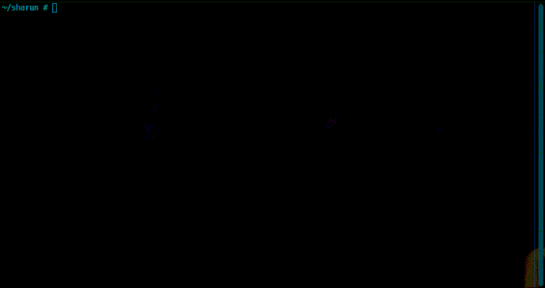
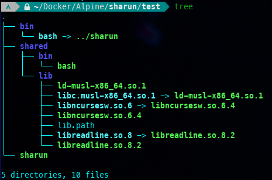

# sharun
Run dynamically linked ELF binaries everywhere (musl and glibc are supported).



* Its works with [userland-execve](https://github.com/io12/userland-execve-rust) by mapping the interpreter (such as ld-linux-x86-64.so.2) into memory, creating a stack for it (containing the auxiliary vector, arguments, and environment variables), and then jumping to the entry point with the new stack.
* [lib4bin](https://github.com/VHSgunzo/sharun/blob/main/lib4bin) pulls out the binary file and all the libraries on which it depends, strip it and forms the `bin`, `shared/{bin,lib,lib32}` directories (see [screenshots](https://github.com/VHSgunzo/sharun?tab=readme-ov-file#screenshots)) and generate a file `shared/{lib,lib32}/lib.path` with a list of all directories that contain libraries for pass it to interpreter `--library-path`. The paths in this file are specified on a new line with a `+` at the beginning and relative to the directory in which it is located.

## Supported architectures:
* aarch64
* x86_64

## To get started:
* **Download the latest revision**
```
git clone https://github.com/VHSgunzo/sharun.git && cd sharun
```

* **Compile a binary**
```
rustup default nightly
rustup target add $(uname -m)-unknown-linux-musl
rustup component add rust-src --toolchain nightly
cargo build --release
cp ./target/$(uname -m)-unknown-linux-musl/release/sharun .
./sharun --help
./sharun lib4bin --help
```
* Or take an already precompiled binary file from the [releases](https://github.com/VHSgunzo/sharun/releases)

## Usage sharun:
```
[ Usage ]: sharun [OPTIONS] [EXEC ARGS]...
    Use lib4bin for create 'bin' and 'shared' dirs

[ Arguments ]:
    [EXEC ARGS]...              Command line arguments for execution

[ Options ]:
     l,  lib4bin [ARGS]         Launch the built-in lib4bin
    -g,  --gen-lib-path         Generate library path file
    -v,  --version              Print version
    -h,  --help                 Print help

[ Environments ]:
    SHARUN_WORKING_DIR=/path    Specifies the path to the working directory
    SHARUN_LDNAME=ld.so         Specifies the name of the interpreter
    SHARUN_DIR                  Sharun directory
```

## Usage lib4bin:
```
[ Usage ]: lib4bin [OPTIONS] /path/executable -- [STRACE CMD ARGS]

[ Options ]:
  -a, --any-executable     Pack any executable (env: ANY_EXECUTABLE=1)
  -d, --dst-dir '/path'    Destination directory (env: DST_DIR=/path)
  -e, --strace-mode        Use strace for get libs (env: STRACE_MODE=1, STRACE_TIME=5)
  -g, --gen-lib-path       Generate a lib.path file (env: GEN_LIB_PATH=1)
  -h, --help               Show this message
  -i, --patch-interpreter  Patch INTERPRETER to a relative path (env: PATCH_INTERPRETER=1)
  -l, --libs-only          Pack only libraries (env: LIBS_ONLY=1)
  -n, --not-one-dir        Separate directories for each executable (env: ONE_DIR=0)
  -p, --hard-links         Pack sharun and create hard links (env: HARD_LINKS=1)
  -q, --quiet-mode         Show only errors (env: QUIET_MODE=1)
  -r, --patch-rpath        Patch RPATH to a relative path (env: PATCH_RPATH=1)
  -s, --strip              Strip binaries and libraries (env: STRIP=1)
  -v, --verbose            Verbose mode (env: VERBOSE=1)
  -w, --with-sharun        Pack sharun from PATH or env or download 
  (env: WITH_SHARUN=1, SHARUN=/path|URL, SHARUN_URL=URL, UPX_SHARUN=1)
```

## Examples:
```
# run lib4bin with the paths to the binary files that you want to make portable
./sharun lib4bin --with-sharun --dst-dir test /bin/bash

# or for correct /proc/self/exe you can use --hard-links flag
./sharun lib4bin --hard-links --dst-dir test /bin/bash
# this will create hard links from 'test/sharun' in the 'test/bin' directory

# now you can move 'test' dir to other linux system and run binaries from the 'bin' dir
./test/bin/bash --version

# or specify them as an argument to 'sharun'
./test/sharun bash --version
```

* You can create a hard link from `sharun` to `AppRun` and write the name of the executable file from the `bin` directory to the `.app` file for compatibility with [AppImage](https://appimage.org) `AppDir`. If the `.app` file does not exist, the `*.desktop` file will be used.

* Additional env var can be specified in the `.env` file (see [dotenv](https://crates.io/crates/dotenv)). Env var can also be deleted using `unset ENV_VAR` in the end of the `.env` file.

* Also you can package the `sharun directory` with your applications into a single executable file using [wrappe](https://github.com/Systemcluster/wrappe)

## Screenshots:


## Environment variables that are set if sharun finds a directory or file:
* `PATH` -- `${SHARUN_DIR}/bin`
* `PYTHONHOME` and `PYTHONDONTWRITEBYTECODE` -- `${SHARUN_DIR}/shared/$LIB/python*`
* `PERLLIB` -- `${SHARUN_DIR}/shared/$LIB/perl*`
* `GCONV_PATH` -- `${SHARUN_DIR}/shared/$LIB/gconv`
* `GIO_MODULE_DIR` -- `${SHARUN_DIR}/shared/$LIB/gio/modules`
* `GTK_PATH`, `GTK_EXE_PREFIX` and `GTK_DATA_PREFIX` -- `${SHARUN_DIR}/shared/$LIB/gtk-*`
* `QT_PLUGIN_PATH` -- `${SHARUN_DIR}/shared/$LIB/qt*/plugins`
* `BABL_PATH` -- `${SHARUN_DIR}/shared/$LIB/babl-*`
* `GEGL_PATH` -- `${SHARUN_DIR}/shared/$LIB/gegl-*`
* `GIMP2_PLUGINDIR` -- `${SHARUN_DIR}/shared/$LIB/gimp/2.0`
* `TCL_LIBRARY` -- `${SHARUN_DIR}/shared/$LIB/tcl*`
* `TK_LIBRARY` -- `${SHARUN_DIR}/shared/$LIB/tk*`
* `GST_PLUGIN_PATH`, `GST_PLUGIN_SYSTEM_PATH`, `GST_PLUGIN_SYSTEM_PATH_1_0`, and `GST_PLUGIN_SCANNER` -- `${SHARUN_DIR}/shared/$LIB/gstreamer-*`
* `GDK_PIXBUF_MODULEDIR` and `GDK_PIXBUF_MODULE_FILE` -- `${SHARUN_DIR}/shared/$LIB/gdk-pixbuf-*`

* `XDG_DATA_DIRS` -- `${SHARUN_DIR}/share`
* `VK_DRIVER_FILES` -- `${SHARUN_DIR}/share/vulkan/icd.d`
* `XKB_CONFIG_ROOT` -- `${SHARUN_DIR}/share/X11/xkb`
* `GSETTINGS_SCHEMA_DIR` -- `${SHARUN_DIR}/share/glib-2.0/schemas`
* `GIMP2_DATADIR` -- `${SHARUN_DIR}/share/gimp/2.0`

* `FONTCONFIG_FILE` -- `${SHARUN_DIR}/etc/fonts/fonts.conf`
* `GIMP2_SYSCONFDIR` -- `${SHARUN_DIR}/etc/gimp/2.0`

## Projects that use sharun:
* [pelfCreator](https://github.com/xplshn/pelf/blob/pelf-ng/pelfCreator)
* [AppBundleHUB](https://github.com/xplshn/AppBundleHUB)
* [android-tools-AppImage](https://github.com/Samueru-sama/android-tools-AppImage)
* [pavucontrol-qt-AppImage](https://github.com/Samueru-sama/pavucontrol-qt-AppImage)
* [rofi-AppImage](https://github.com/Samueru-sama/rofi-AppImage)
* [mpv-AppImage](https://github.com/Samueru-sama/mpv-AppImage)
* [OBS-Studio-AppImage](https://github.com/Samueru-sama/OBS-Studio-AppImage)
* [GIMP-AppImage](https://github.com/Samueru-sama/GIMP-AppImage)

## References
* [userland-execve](https://crates.io/crates/userland-execve)
* https://brioche.dev/blog/portable-dynamically-linked-packages-on-linux
